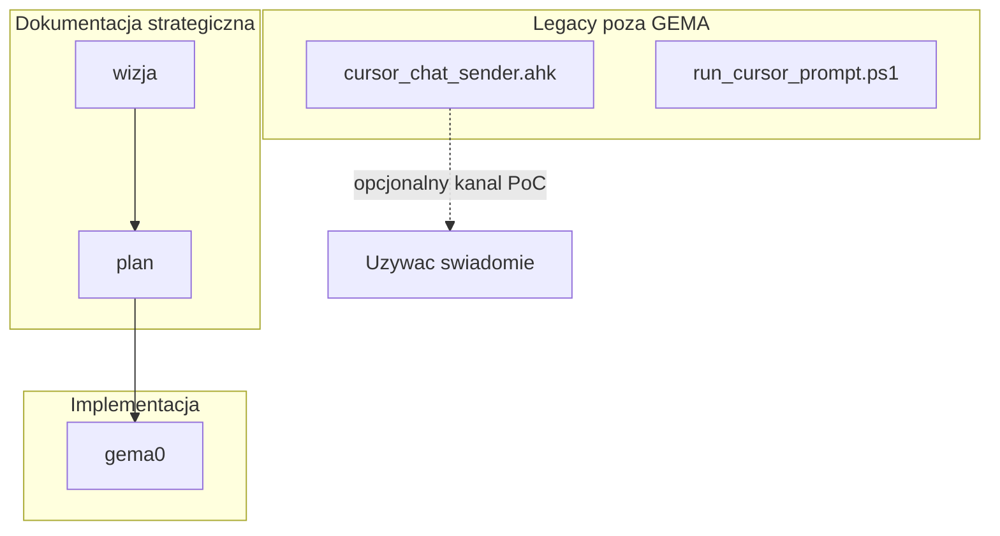

# START — Cursor / AI w folderze `_RPA_AUTOMATION`

## Start sesji — co zrobić najpierw (żeby nie było pomyłek)

1. **Przeczytaj ten plik** (`START_TUTAJ_CURSOR.md`) do końca lub przynajmniej sekcje: **Diagram**, **Role**, **Żelazne zasady**.
2. **Zanim dotkniesz jakiegokolwiek pliku przy konkretnej zmianie**, otwórz **[`PROCES_ZMIANY_I_RAPORT.md`](PROCES_ZMIANY_I_RAPORT.md)** — tam jest **jednoznaczna tabela: typ zmiany → które foldery edytować** oraz **szablon krótkiego raportu końca pracy**.
3. Na końcu każdej realnej sesji edycyjnej wklej **minimalny raport** z szablonu z `PROCES_ZMIANY_I_RAPORT.md` (czat / notatka / commit).

**Trzy warstwy bez zamętu:** [**wizja** = *co* budujemy](wizja/README.md) → [**plan** = *jak* to wdrażamy zgodnie z wizją](plan/README.md) → [**gema0** = kod](gema0/README.md).

Ten katalog jest **sandboxem automatyzacji RPA** dla Cursor na Windows: główny produkt to **GEMA-0 Command Center** w [`gema0/`](gema0/README.md). Ten START nie zastępuje szczegółów kodu — wskazuje źródła prawdy i kolejność czytania.

---

## Diagram: dokumenty i kod

- **wizja** → **plan** → **implementacja** w **gema0**.
- Skrypty **AHK / PowerShell** w korzeniu `_RPA_AUTOMATION/` to starszy **PoC** obok GEMA-0 — nie mylić z pipeline’em panelu bez wyraźnej decyzji.

---

## Role: kto czego dotyka

| Rola | Zakres | Gdzie czytać |
|------|--------|----------------|
| **Architekt produktu / autor wizji** | Decyzje „co”; checklisty w `wizja/01`–`05`; zamknięcia w `wizja/99_*` | [`wizja/README.md`](wizja/README.md) |
| **Planista wdrożenia** | Fazy, ryzyka; **bez** nowych wymagań produktowych bez linku do konkretnego pliku wizji | [`plan/README.md`](plan/README.md), [`plan/00_zrodla_wizji.md`](plan/00_zrodla_wizji.md) |
| **Implementer Node/Python** | Kod w `gema0`; zgodność z mapowaniem [`wizja/05_mapowanie_na_gema0.md`](wizja/05_mapowanie_na_gema0.md) i aktywną fazą w [`plan/fazy/`](plan/fazy/) | [`gema0/`](gema0/README.md) |
| **Operator / tester RPA** | Uruchomienie panelu, healthcheck, `windows_map.json`; świadomość że RPA nie działa „cicho w tle” | [`gema0/README.md`](gema0/README.md) |

---

## Obowiązkowa kolejność lektury

1. **Ten plik** — `START_TUTAJ_CURSOR.md`.
2. **[`PROCES_ZMIANY_I_RAPORT.md`](PROCES_ZMIANY_I_RAPORT.md)** — zanim edytujesz cokolwiek: *gdzie grzebać* + raport końca sesji.
3. **[`wizja/README.md`](wizja/README.md)** — potem dokumenty wg indeksu: `00` → `01` … → `05` → `99`.
4. **[`plan/README.md`](plan/README.md)** — następnie [`plan/00_zrodla_wizji.md`](plan/00_zrodla_wizji.md), [`plan/01_ryzyka_i_zalozenia.md`](plan/01_ryzyka_i_zalozenia.md), [`plan/fazy/`](plan/fazy/), [`plan/99_analiza_i_roadmap.md`](plan/99_analiza_i_roadmap.md).
5. **[`gema0/README.md`](gema0/README.md)** — instalacja, komendy panelu, konfiguracja okien.

Instrukcja **uzupełniania samego katalogu wizji** (meta): [`wizja/00_START_TUTAJ.md`](wizja/00_START_TUTAJ.md) — to nie jest ten sam plik co niniejszy START.

---

## Konwencje utrwalone

- **KONIEC:** Punkt zaakceptowany przez właściciela produktu w plikach `wizja/99_*` lub `plan/99_*` — linia kończy się wyłącznie słowem **`KONIEC`** (bez przekreśleń markdown jako głównej metody). Szczegóły: [`wizja/00_START_TUTAJ.md`](wizja/00_START_TUTAJ.md).
- **Plan zależy od wizji:** Nowych wymagań produktowych do planu wdrożenia **nie dodajesz** bez odwołania do pliku w [`wizja/`](wizja/README.md). Kontrakt: [`plan/README.md`](plan/README.md), [`plan/00_zrodla_wizji.md`](plan/00_zrodla_wizji.md).
- **Linki względne** między dokumentami w `wizja/` i `plan/`.

---

## Żelazne zasady

1. **Sandbox:** Domyślny zakres pracy agenta to **`_RPA_AUTOMATION/`** (zwłaszcza **`gema0/`**). Integracja z innymi częściami monorepo (np. SliceHub, core PHP) **tylko po wyraźnej decyzji** architektonicznej — nie rozszerzaj domyślnie zakresu poza ten folder.
2. **Kontrakt dokumentów:** Intencja produktowa ma **tranzyt przez `wizja/`**; plan wdrożenia **musi** być spięty ze źródłami wizji ([`plan/00_zrodla_wizji.md`](plan/00_zrodla_wizji.md)).
3. **RPA:** Cursor **nie** udostępnia publicznego API czatu dla zewnętrznego procesu — kanał docelowy to **symulacja klawiatury i schowka** + kolejka **jednego** zadania naraz (patrz `queue` w `gema0`). Nie projektuj „cichej” automatyzacji bez logu i bez świadomości operatora (panic / pauza kolejki).
4. **Sekrety:** `GEMINI_API_KEY` i inne klucze wyłącznie w `.env` w `gema0`; **nie commituj** sekretów.
5. **Konwencja KONIEC:** W dokumentach końcowych zamykaj akceptowane punkty wyłącznie przez **`KONIEC`** na końcu linii (patrz wyżej).
6. **Stan kodu vs wizja:** Nie myl opisu docelowego z faktyczną implementacją — źródło mapowania: [`wizja/05_mapowanie_na_gema0.md`](wizja/05_mapowanie_na_gema0.md); instalacja i komendy: [`gema0/README.md`](gema0/README.md).

**Tryb izolacji RPA (opcjonalnie):** Jeśli użytkownik narzuci pracę **wyłącznie** w `_RPA_AUTOMATION`, reszta workspace poza tym folderem jest **poza zakresem** — nie wyciągaj z niej wymagań ani nie edytuj bez wyraźnej zgody.
