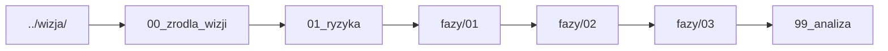

# Plan wdrożenia GEMA-0

**Przed edycją:** [`../START_TUTAJ_CURSOR.md`](../START_TUTAJ_CURSOR.md) i [`../PROCES_ZMIANY_I_RAPORT.md`](../PROCES_ZMIANY_I_RAPORT.md) — przy zmianach wdrożeniowych (typ B) edytujesz przede wszystkim ten katalog `plan/`, bez dopisywania nowej intencji produktowej bez wpisu w [../wizja/](../wizja/README.md).

Plan implementacji **musi** wynikać z katalogu [../wizja/](../wizja/README.md). Nie wprowadzaj nowych wymagań produktowych tutaj bez odwołania do konkretnego pliku wizji.

## Kolejność czytania

1. [00_zrodla_wizji.md](00_zrodla_wizji.md) — mapowanie: które pliki wizji są wchłaniane w ten plan.
2. [01_ryzyka_i_zalozenia.md](01_ryzyka_i_zalozenia.md) — ograniczenia techniczne (RPA, brak API Cursor).
3. [fazy/01_faza_fundament.md](fazy/01_faza_fundament.md) — utrwalenie API, kolejki, RPA.
4. [fazy/02_faza_panel_i_historia.md](fazy/02_faza_panel_i_historia.md) — UI, transcript, zapis odpowiedzi.
5. [fazy/03_faza_auto_push.md](fazy/03_faza_auto_push.md) — watcher, profile auto-push.
6. [99_analiza_i_roadmap.md](99_analiza_i_roadmap.md) — podsumowanie iteracji, sugestie, **KONIEC** dla zaakceptowanych etapów.

## Zależność

