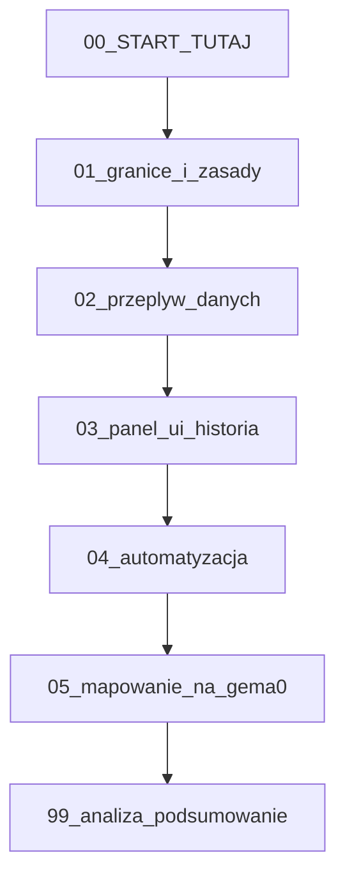

# Wizja produktowa — GEMA-0 / RPA Automation

**Przed edycją tego katalogu:** przeczytaj [`../START_TUTAJ_CURSOR.md`](../START_TUTAJ_CURSOR.md) oraz [`../PROCES_ZMIANY_I_RAPORT.md`](../PROCES_ZMIANY_I_RAPORT.md) — tam jest ustalenie, *kiedy* wchodzisz w `wizja/` (typ A zmiany), żeby nie dublować ani nie rozjeżdżać się z `plan/` i `gema0/`.

Ten katalog zbiera **docelowy opis zachowania** systemu Command Center (`gema0/`) i powiązanych przepływów (notatki, push do Cursor, automatyzacja). Nie zastępuje dokumentacji kodu w [`../gema0/README.md`](../gema0/README.md); uzupełnia ją intencją produktową.

## Kolejność czytania

1. [00_START_TUTAJ.md](00_START_TUTAJ.md) — jak uzupełniać te pliki (Cursor / człowiek).
2. [01_granice_i_zasady.md](01_granice_i_zasady.md) — sandbox, bezpieczeństwo.
3. [02_przeplyw_danych.md](02_przeplyw_danych.md) — od `.md` do Cursor i z powrotem (w granicach możliwości).
4. [03_panel_ui_historia.md](03_panel_ui_historia.md) — UI, dwa tory, historia.
5. [04_automatyzacja.md](04_automatyzacja.md) — auto-push, reguły, dedupe.
6. [05_mapowanie_na_gema0.md](05_mapowanie_na_gema0.md) — stan kodu vs luki.
7. [99_analiza_podsumowanie.md](99_analiza_podsumowanie.md) — podsumowanie, sugestie, punkt `KONIEC` dla pozycji zaakceptowanych przez właściciela produktu.

## Powiązanie z planem wdrożenia

Po ustabilizowaniu wizji kolejny krok to [`../plan/`](../plan/README.md) — plan implementacji musi odwoływać się do konkretnych plików z tego folderu.

## Diagram relacji dokumentów

