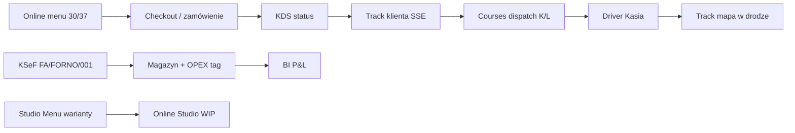

# PROMPT — Nagranie pełnej ścieżki procesów · Pizza Forno · SPARK 3.0

> **Skopiuj cały blok od linii `---` do nowego okna Cloud Agent** (model: Sonnet lub równoważny; subagent `computerUse` + `RecordScreen` + opcjonalnie `videoReview`).  
> Ten dokument jest **kanonicznym briefem na jedno długie nagranie** (surowe sceny) + **montaż przyspieszonego wideo** (60–90 s finał).  
> **⚠️ Nagranie wideo:** użyj **[`PROMPT_SPARK_NAGRANIE_PROCESY_FORNO_V2.md`](PROMPT_SPARK_NAGRANIE_PROCESY_FORNO_V2.md)** — **7 procesów biznesowych**, klik-po-kliku, max 2–3 s bez ruchu; zakaz sklejki modułów / Playwright.  
> Uzupełnia `PROMPT_SPARK_PREZENTACJA_IDEALNA.md` (screeny/PDF — bez wideo) i `PROMPT_SPARK_VIDEO_SCREENS.md` (stary 60s tour bez łańcucha procesów).

---

# Zadanie: nagraj pełną ścieżkę „jeden dzień w Pizzerii Forno” i zmontuj timelapse

## 0. Kontekst (nie pomijaj)

- **Produkt:** SliceHub Pro na https://slicehub.net — tenant **Pizza Forno** (`tenant_id=2`).
- **Menu demo:** **nie** 4 pizze testowe — pełne menu **1:1 z eksportu Forno** (~190 pozycji) z **innowacyjnym podziałem rozmiarów** (pizza **30 cm / 37 cm**, panini **MAŁE / DUŻE** jako warianty, nie osobne kategorie).
- **Źródło seeda:** `scripts/seed_pizzaforno.sql` (+ opcjonalnie `_docs/demo_seed_dynamic_data.sql` dla kierowców DEMO).
- **Wnioskodawca:** Damian Malenta — narracja **po ludzku**, pierwsza osoba lub bezosobowo; **bez** wymyślonego MRR, ARR, liczby klientów.
- **Cel materiału:** wniosek SPARK 3.0 — komisja ma **zobaczyć łańcuch**, nie listing modułów.

---

## 1. Przed nagraniem — wgranie i weryfikacja seeda (OBOWIĄZKOWE)

### 1.1 Kolejność wgrania (produkcja / phpMyAdmin)

```sql
-- Sprawdź tenant:
SELECT id, name FROM sh_tenant WHERE id = 2;

-- 1) Pełne menu + magazyn + KSeF + zamówienia FORNO-*:
--    Wklej całość: scripts/seed_pizzaforno.sql

-- 2) Opcjonalnie — kierowcy demo (Jan/Tomasz) + zamówienia DEMO-* do dispatchu:
--    _docs/demo_seed_dynamic_data.sql
--    (Kasia @slicehub.net jest osobnym kontem produkcyjnym — używaj jej w nagraniu kierowcy)
```

### 1.2 Weryfikacja po wgraniu

```bash
bash scripts/seed_pizzaforno_verify.sh slicehub_pro_v2 2
# Oczekiwane: FAIL=0, ≥190 menu items, 8× FORNO-001..008, 3× FA/FORNO/*
```

### 1.3 Przygotowanie KDS + kierowca (żeby NIE było pustki)

Seed sam z siebie często daje **pusty KDS** (statusy `delivered` / `in_route` bez `driver_id`) i **pustą Driver App**. Przed nagraniem uruchom skrypt (lub ręcznie te same kroki API):

```bash
python3 scripts/prep_spark_demo_orders.py
# → recall FORNO-004 na KDS (preparing)
# → nowe zamówienie delivery → accepted → preparing → ready → dispatch na Kasię
```

Alternatywa: `_docs/PROMPT_SPARK_NAGRANIE_PROCESY_FORNO.md` + agent wykonuje `scripts/record_spark_forno_demo.py` po prep.

### 1.4 Przygotowanie pod tracking WWW (seed nie ustawia `tracking_token`)

Wykonaj **raz** na produkcji (dla sceny mapy klienta):

```sql
SET @tid := 2;
UPDATE sh_orders
SET tracking_token = LOWER(SUBSTRING(REPLACE(id,'-',''), 1, 16))
WHERE tenant_id = @tid AND order_number = 'FORNO-006' AND tracking_token IS NULL;

SELECT order_number, tracking_token, customer_phone
FROM sh_orders WHERE tenant_id = @tid AND order_number = 'FORNO-006';
-- Zapisz token + telefon (+48 504 321 987) — użyjesz w track.html
```

URL trackera (podstaw `TOKEN` z SELECT):

`https://slicehub.net/modules/online/track.html?tenant=2&token=TOKEN&phone=%2B48504321987`

### 1.5 Co masz w seedzie — ściąga dla operatora

| Zasób | Wartość |
|-------|---------|
| Kategorie | PIZZE (30/37 jako wariant), PANINI (MAŁE/DUŻE), + 14 innych |
| Skale | `SCALE_PIZZA` (30CM, 37CM), `SCALE_PANINI` (MALE, DUZE) |
| Zamówienia | FORNO-001 `accepted` · FORNO-002 `preparing` · FORNO-006 `in_route` · FA/FORNO/2026/001 `new` |
| Dokumentacja | `_docs/menu_pizzaforno/SEED_DESIGN.md`, `SEED_REPORT.md` |

---

## 2. Dane logowania (produkcja)

| Rola | Login | Hasło | Moduł |
|------|-------|-------|-------|
| Owner / Hub | `Damian` | `Dammalq123123` | Hub, KDS, Courses, KSeF, BI, Studio |
| Kierowca PWA | `kasia@slicehub.net` | `asdasd` | Driver App |
| POS (PIN) | — | `1111` | Kasa |

**API (JWT do Playwright — KRYTYCZNE):**

Formularz WWW **nie reaguje** na zwykłe `xdotool`. Obowiązkowo: `POST /api/auth/login.php` → `localStorage.sh_token` + `sh_user` → reload.

```bash
curl -s -X POST 'https://slicehub.net/api/auth/login.php' \
  -H 'Content-Type: application/json' \
  -d '{"mode":"system","username":"Damian","password":"Dammalq123123"}'
```

Online storefront (publiczny): `https://slicehub.net/modules/online/index.html` (tenant z meta / tenant_config).

---

## 3. Oś narracji — łańcuch do pokazania



**Komunikat dla komisji (mów w głowie / voiceover):**  
„To nie pięć programów — jedno zamówienie idzie przez menu, kuchnię, dostawę i fakturę, a właściciel widzi marżę bez Excela.”

---

## 4. Storyboard nagrania (surowe sceny, ~8–12 min)

Nagrywaj **1920×1080**, ciemny motyw, bez DevTools. Każda scena: **15–45 s** (w montażu przyspieszysz).

| # | Czas surowy | Moduł / URL | Akcja | Co musi być w kadrze |
|---|-------------|-------------|-------|----------------------|
| 1 | 0:00–1:00 | Online `index.html` | Scroll kategoria **PIZZE** → klik **MARGHERITA** → przełącz **30 cm / 37 cm** (cena się zmienia) | Warianty rozmiaru, nie dwie osobne pozycje menu |
| 2 | 1:00–1:30 | Online | PANINI → pokaż **MAŁE / DUŻE** | Druga skala wariantów |
| 3 | 1:30–2:30 | Online → koszyk | Dodaj pizzę 37 cm + napój → **guest checkout** (telefon testowy) **LUB** pomiń jeśli czas — wtedy użyj FORNO-002 w KDS | Potwierdzenie z kodem trackera (jeśli checkout) |
| 4 | 2:30–3:30 | KDS `/modules/kds/` | JWT Damian → lista biletów → **FORNO-002** (preparing) → bump do **ready** / gotowe | Kuchnia zmienia status |
| 5 | 3:30–4:30 | Track `track.html?tenant=2&token=…&phone=…` | Otwórz przygotowany URL FORNO-006 **lub** token z sceny 3 | Timeline statusu (SSE), bez logowania |
| 6 | 4:30–6:00 | Courses `/modules/courses/` | Mapa → zamówienie **FORNO-001** (accepted, Jan Kowalski) → **dispatch** na **Kasię** (zielony/available na POS flocie jeśli widoczne) | Kurs **K{n}**, przystanek **L{n}** |
| 7 | 6:00–7:30 | Driver App | Wyloguj Damian → JWT **Kasia** → trasa / lista stopów → **nie** zamykaj bez płatności (pokaż Payment Lock jeśli cash) | PWA, duże przyciski |
| 8 | 7:30–8:30 | Track ponownie | Po „wyjeździe” kierowcy — **mapa Leaflet** z pozycją (FORNO-006 in_route) | „Jedzenie w drodze” |
| 9 | 8:30–10:00 | Procurement KSeF | `FA/FORNO/2026/001` status **new** → AutoScan / mapowanie linii → tag **INVENTORY** vs **EXPENSE (OPEX)** → akceptacja | Bez przepisywania ręcznego |
| 10 | 10:00–10:45 | BI `/modules/bi/` | Klik **Załaduj** → P&L: COGS + OPEX + zapas | Proste liczby, nie dashboard analityka |
| 11 | 10:45–11:30 | Studio Menu | Drzewo → **MARGHERITA** parent → dzieci **30CM/37CM** + receptura | Innowacja wariantów w backoffice |
| 12 | 11:30–12:00 | Hub → Profil firmy | NIP, dane lokalu | Zaufanie do KSeF |
| 13 | 12:00–12:30 | Online Studio (jeśli jest w Hub) | Pokaż **WIP** uczciwie: „konfigurator wyglądu sklepu — w rozwoju” | Nie udawaj gotowca |

**Zamówienia seed — przypomnienie:**

| Nr | Status | Użycie w scenie |
|----|--------|-----------------|
| FORNO-001 | accepted | Dispatch w Courses |
| FORNO-002 | preparing | Bump w KDS → zmiana na track (jeśli powiązane) |
| FORNO-006 | in_route | Track + mapa |
| FORNO-008 | completed | Opcjonalnie POS historia |

---

## 5. Procedura techniczna nagrania

### 5.1 RecordScreen

1. `computerUse` → Chrome 1920×1080 → https://slicehub.net  
2. Zaloguj przez **JWT inject** (nie formularz) — patrz §2.  
3. `RecordScreen` → `mode=START_RECORDING`  
4. Wykonaj sceny 1–13 (można 2–3 ujęcia po jednej scenie jeśli pomyłka).  
5. `RecordScreen` → `mode=SAVE_RECORDING` → `save_as_filename=spark_forno_procesy_raw`  
6. Plik: `/opt/cursor/artifacts/spark_forno_procesy_raw.webm`  
7. `videoReview` subagent — sprawdź: widać **warianty 30/37**, **KDS bump**, **dispatch**, **track+mapa**, **KSeF**, **BI**.

### 5.2 Playwright (alternatywa / uzupełnienie screenshotów)

Wzoruj się na `scripts/capture_spark_screenshots.py` — ten sam JWT inject. Dla Online **nie** używaj JWT (strona publiczna).

### 5.3 POS — flota kierowców

Po dispatch FORNO-001 na Kasię: szybki rzut oka **POS** (PIN `1111`) → zakładka/flota → Kasia **zielona/dostępna** lub **busy** po przydziale (5–10 s w surowym materiale).

---

## 6. Montaż — wideo przyspieszone (60–90 s)

Po zapisaniu surowego nagrania:

```bash
# Zainstaluj ffmpeg jeśli brak
which ffmpeg || sudo apt-get install -y ffmpeg

IN="/opt/cursor/artifacts/spark_forno_procesy_raw.webm"
OUT="/opt/cursor/artifacts/spark_forno_procesy_90s.mp4"

# Przyspieszenie ~5–8× (dostosuj setpts po podglądzie)
ffmpeg -y -i "$IN" -filter_complex \
  "[0:v]setpts=0.15*PTS,fps=30[v];[0:a]atempo=2.0,atempo=2.0[a]" \
  -map "[v]" -map "[a]" -c:v libx264 -preset fast -crf 23 -c:a aac -b:a 128k \
  -t 90 "$OUT"

# Wersja BEZ audio (do slajdów / F6S upload limit):
ffmpeg -y -i "$IN" -vf "setpts=0.12*PTS,fps=30" -an -t 75 \
  /opt/cursor/artifacts/spark_forno_procesy_silent.mp4
```

**Kolejność cięć w montażu (jeśli ręcznie w edytorze):**  
Online warianty (5 s) → KDS (8 s) → Track (8 s) → Courses+Driver (15 s) → Track mapa (8 s) → KSeF (12 s) → BI (8 s) → Studio warianty (8 s) → Hub (5 s).

Dostarcz w odpowiedzi:

```html
<video src="/opt/cursor/artifacts/spark_forno_procesy_90s.mp4" controls></video>
```

---

## 7. Narracja po ludzku (szkic voiceover — opcjonalnie)

| Sekunda | Tekst |
|---------|-------|
| 0–10 | „Klient wybiera pizzę — ale nie dwie pozycje w menu: **30 albo 37 centymetrów** to ten sam produkt, inna cena.” |
| 10–25 | „Zamówienie trafia do kuchni na ekranie — **status na telefonie klienta zmienia się sam**, bez odświeżania strony.” |
| 25–45 | „Dyspozytor widzi mapę, składa kurs **K** z przystankami **L**, kierowca dostaje trasę na telefonie.” |
| 45–60 | „Faktura z KSeF nie ląduje w Excelu — system **podpowiada surowce**, resztę oznaczam jako koszt lokalu.” |
| 60–75 | „Na koniec właściciel widzi: czy ten tydzień się spina — **bez analityka BI**.” |

**Zakazy:** nie podawaj MRR, liczby płacących klientów, „zespół 10 osób”, daty premiery bez pokrycia w produkcie.

---

## 8. Innowacja do podkreślenia (SPARK)

1. **Variant Scales** — rozmiar jako wariant rodziny (PIZZE, PANINI), nie duplikat kategorii z choiceqr.  
2. **F-S2 modifier pricing** — ta sama grupa „dodatkowe warzywa”, inna cena dla 30 vs 37 cm.  
3. **Server-authoritative cart** — online checkout z lockiem, tracking token.  
4. **KSeF → magazyn + OPEX** — jedna linia faktury, dwa przeznaczenia, P&L bez podwójnego liczenia.  
5. **Payment lock** — kierowca nie „zgubi” gotówki zamykając dostawę.

---

## 9. Czego NIE robić

- ❌ Nagrywać pusty POS (4 demo pizze) — **najpierw seed Pizza Forno**.  
- ❌ Udawać gotowy **Online Studio** — tylko WIP + wartość wizji.  
- ❌ Logować się wyłącznie przez formularz WWW (zawiedzie).  
- ❌ Pitch deck / one-pager / teksty wniosku — to osobny prompt (`PROMPT_SPARK_PREZENTACJA_IDEALNA.md`).  
- ❌ Wymyślać metryki biznesowe.

---

## 10. Deliverables (checklist)

- [ ] `seed_pizzaforno.sql` wgrany + `seed_pizzaforno_verify.sh` PASS  
- [ ] `tracking_token` ustawiony dla FORNO-006 (lub świeży checkout)  
- [ ] Surowe nagranie: `/opt/cursor/artifacts/spark_forno_procesy_raw.webm`  
- [ ] Montaż: `spark_forno_procesy_90s.mp4` (+ opcjonalnie `_silent.mp4`)  
- [ ] `videoReview` — potwierdzenie 6 kluczowych momentów  
- [ ] Krótki raport: które sceny wyszły, co wymagało SQL prep  

---

## 11. Powiązane pliki w repo

| Plik | Rola |
|------|------|
| `scripts/seed_pizzaforno.sql` | Menu 1:1 + FORNO zamówienia + KSeF |
| `scripts/seed_pizzaforno_verify.sh` | Walidacja po wgraniu |
| `_docs/menu_pizzaforno/SEED_DESIGN.md` | Mapowanie choiceqr → SliceHub |
| `_docs/demo_seed_dynamic_data.sql` | Kierowcy DEMO + DEMO-001 dispatch |
| `_docs/SPARK_materialy/OPISY_DLA_WNIOSKU.md` | Język ludzki pod formularz |
| `_docs/PROMPT_SPARK_PREZENTACJA_IDEALNA.md` | Screenshoty + PDF (bez nagrania) |

---

*Rewizja: 2026-05-20 · Pizza Forno seed · pełna ścieżka procesów + montaż timelapse*
