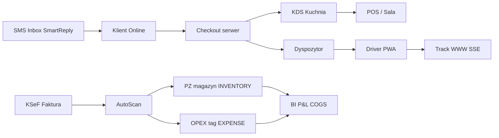

# PROMPT — Idealna prezentacja SliceHub Pro (slicehub.net) · SPARK 3.0

> **Skopiuj cały blok od linii `---` do nowego okna Cloud Agent (model: Sonnet lub równoważny do UI/HTML).**  
> Ten dokument zastępuje stare prompty (`PROMPT_SPARK_REWORK_BEZ_VIDEO`, `PROMPT_SPARK_PELEN_PAKIET`) jako **jeden kanoniczny brief** na materiały wizualne + narrację wniosku (2026-05-20).  
> **Nagranie pełnej ścieżki procesów + timelapse (Pizza Forno seed):** [`PROMPT_SPARK_NAGRANIE_PROCESY_FORNO.md`](PROMPT_SPARK_NAGRANIE_PROCESY_FORNO.md).

---

# Zadanie: Wyprodukuj idealną prezentację produktu SliceHub na slicehub.net

## 0. Kontekst (nie pomijaj)

- **Produkt:** SliceHub Enterprise / SliceHub Pro — multi-tenantowy OS gastronomii (nie „kolejna kasa”).
- **Produkcja:** https://slicehub.net — działa na prawdziwym hostingu, demo Pizza Forno (tenant_id=2).
- **Wnioskodawca:** solo founder **Damian Malenta** — w tekstach **pierwsza osoba liczby pojedynczej** lub bezosobowo; **NIE** „zespół SliceHub”, **NIE** „my” w pluralis majestatis.
- **Program:** PFR SPARK 3.0 Accelerator, ścieżka **„go global"**, budżet do **400 000 PLN**.
- **Wideo:** użytkownik **ma już nagrane demo 60s** — **NIE nagrywaj nowego wideo**, **NIE używaj RecordScreen**.
- **Merytoryka techniczna (już odświeżona w repo):** `wniosek*.md`, `_docs/F6S_SPARK_3_0/03_TEKSTY_FORMULARZ_F6S.md`, rewizja 2026-05-20.

Twoje zadanie: **materiały wizualne + PDF + landing** odzwierciedlające **rzeczywisty stan produkcji**, z pełną ścieżką demo (kierowca, KDS, status online, SMS, KSeF z tagami, BI).

---

## 1. Dane logowania (produkcja)

| Rola | Login | Hasło | Moduł startowy | Uwagi |
|------|-------|-------|----------------|-------|
| **Owner / backoffice** | `Damian` | `Dammalq123123` | Hub (`mode=system`) | tenant_id=2, pełny dostęp |
| **Kierowca (PWA)** | `kasia@slicehub.net` | `asdasd` | Driver App (`target_module: driver_app`) | API login `mode=system` działa; rola `driver` |
| **Kasa (PIN kiosk)** | — | `1111` | POS | Po wejściu w POS z Hubu |

**API (weryfikacja tokenu):**
```bash
curl -s -X POST 'https://slicehub.net/api/auth/login.php' \
  -H 'Content-Type: application/json' \
  -d '{"mode":"system","username":"Damian","password":"Dammalq123123"}'
# localStorage: sh_token + sh_user (JSON user z odpowiedzi)
```

**KSeF / NIP:** Backoffice → Profil firmy (`sh_tenant.nip`) — test połączenia w Settings/KSeF to `GET /rate-limits` po JWT v2.

---

## 2. Autentykacja w automatyzacji (KRYTYCZNE)

Formularz logowania w przeglądarce **nie reaguje** na zwykłe `xdotool` / computerUse typing. **Obowiązkowa metoda:** Playwright (lub Chromium CDP) + JWT z API.

```python
# Po POST login.php:
await page.goto('https://slicehub.net/modules/hub/index.html')
await page.evaluate('''([token, user]) => {
  localStorage.setItem('sh_token', token);
  localStorage.setItem('sh_user', JSON.stringify(user));
}''', [token, user_dict])
await page.reload(wait_until='networkidle')
# Hub powinien pokazać kafelki (hub-dash), nie formularz logowania
```

Klucze: `sh_token`, `sh_user`. Role Hub: `owner`, `admin`, `manager`.

Moduły wymagające JWT w nagłówku: Warehouse, Procurement, BI, Studio, Courses, Settings.  
POS: osobno PIN `1111`. Driver App: login **email+hasło** (Kasia).

---

## 3. Oś narracji — „jeden dzień w restauracji” (story spine)

Prezentacja ma pokazać **spójny łańcuch**, nie zbiór screenshotów:



**Komunikat inwestorski (1 zdanie):**  
„SliceHub to jeden model danych od e-faktury i surowca, przez koszt dania i kuchnię, po dostawę i SMS do klienta — z widoczną marżą w dashboardzie P&L.”

---

## 4. Co KONIECZNIE podkreślić (sprawdzone w kodzie + produkcji)

### 4.1 KSeF — podział faktury (killer feature PL 2026)

- **API MF v2** (`core/Ksef/Client.php`): JWT + kontekst NIP, poll metadata, pobranie XML.
- **Moduł:** `/modules/procurement/` — Inbox KSeF.
- **AutoScan:** poziomy dopasowania **EXACT / ALIAS / NAME / FUZZY** na liniach faktury.
- **Linie `line_type`:**
  - **`INVENTORY`** → akceptacja → **`PzEngine`** → magazyn + AVCO (surowiec).
  - **`EXPENSE`** → tag **kategorii OPEX** (`sh_expense_categories`) → **bez PZ**, trafia do **BI P&L** (brak podwójnego liczenia).
- **UI:** przyciski **OPEX**, **Zapisz zmiany**, **Zaznacz z tagiem**, bulk edit linii; zakładki statusów PL.
- **Benchmark do slajdu:** faktura → magazyn **~30 s** vs **15–20 min** ręcznego przepisywania (nie wymyślaj MRR — tylko ten benchmark operacyjny).

**Screenshot must-have (`hero_07_ksef.png`):** lista 2+ faktur + otwarta FA/DEMO/2026/001 z widocznymi badge AutoScan + przełącznik Towar/OPEX na linii.

### 4.2 BI P&L — statystyki dla właściciela

- **Moduł:** `/modules/bi/` — dashboard **BI — P&L**.
- **Metryki (okres dat):** przychód netto, COGS (z **wielu WZ** per zamówienie), koszty pracy (`sh_payroll_ledger`), **OPEX z KSeF EXPENSE**.
- **Poza okresem:** karta **„Zamrożony kapitał”** — `SUM(qty × AVCO)` z `wh_stock` (snapshot „tu i teraz”).
- **Screenshot opcjonalny (`hero_08_bi.png`):** dashboard z wypełnionymi liczbami po odświeżeniu (ostatnie 30 dni).

### 4.3 Logistyka end-to-end (Kasia + dyspozytor)

- **Courses** `/modules/courses/`: mapa Leaflet, kursy **K{n}**, przystanki **L{n}**, dispatch multi-order.
- **Driver PWA** `/modules/driver_app/`: login Kasia, **Payment Lock** (brak „dostarczono” bez `collect_payment`), **Driver Wallet**, GPS co 15 s.
- **Emergency Recall:** dyspozytor → `heading=-999` → czerwony overlay + wibracje → `clear_recall`.
- **Screenshot:** `hero_05_courses.png` (mapa + 2 kierowców + kolejka), `hero_09_driver.png` (ekran trasy/portfela Kasi).

### 4.4 Kuchnia (KDS)

- `/modules/kds/` — bump `accepted → preparing → ready`, recall, filtr stacji, **driver_action_type** na liniach (pack_cold itd.).
- **Screenshot:** `hero_10_kds.png` — siatka ticketów z 2+ zamówieniami w statusach różnych.

### 4.5 Klient WWW — status i tracking

- **Storefront** `/modules/online/` — sceny wizualne, **warianty rozmiaru** (badge „Rozmiary →”).
- **Track** `/modules/online/track.html` — śledzenie zamówienia (token + phone), **SSE** real-time (`api/online/sse.php`), mapa, promised time.
- **Screenshot:** `hero_02_online.png` (menu + warianty), `hero_11_track.png` (strona śledzenia z timeline).

### 4.6 POS żywy (nie pusty sandbox)

- Koszyk z 2–3 pozycjami, sidebar kierowców/kelnerów, kategoria Pizze, opcjonalnie modal **„Wybierz rozmiar”**.
- Zamówienia demo: DEMO-001 (delivery, paid online), DEMO-002 (takeaway), DEMO-003 (sala).
- **Screenshot:** `hero_03_pos.png`.

### 4.7 Studio Menu + marża

- Edytor pizzy, receptura rozwinięta, **variant scales F-S1**, **Bliźniak Cyfrowy / Food Cost** per kanał.
- **Screenshot:** `hero_04_studio.png` — najmocniejszy kadr pakietu.

### 4.8 SMS i CRM (bez Twilio)

- **Inbox** `/modules/inbox/` — wątki SMS, statystyki (`inbox_stats`: today, total, unread).
- **Marketing** `/modules/marketing/` — kampanie SMS przez outbox.
- **Personal Phone Channel** — SMS z telefonu właściciela (Android Gateway / HTTP); **SmartReply** (ETA, STOP, reorder) — opis na slajdzie, screenshot Inbox jeśli są wiadomości demo.

### 4.9 Architektura (slajd techniczny, bez hype)

- **17 modułów operacyjnych**, **55 migracji SQL**, **62 testy API** (`tests/test_runner.html`).
- **Zero Node w runtime**, multi-tenant `tenant_id`, silosy SKU (`sh_` / `sys_` / `wh_`).
- **Offline POS:** IndexedDB + outbox + UUID v7 — jedna linia na slajdzie.

---

## 5. Macierz screenshotów (Deliverable 1)

Wszystkie PNG **1920×1080** → najpierw `/opt/cursor/artifacts/`, potem kopia do `_docs/SPARK_materialy/`.

| Plik | Priorytet | Scena |
|------|-----------|-------|
| `hero_01_hub.png` | P0 | Hub — wszystkie kafelki |
| `hero_02_online.png` | P0 | Storefront, 3–4 dania, badge Rozmiary |
| `hero_03_pos.png` | P0 | POS, koszyk 2–3 poz., sidebar |
| `hero_04_studio.png` | P0 | Studio + Food Cost |
| `hero_05_courses.png` | P0 | Dispatcher + mapa + kierowcy |
| `hero_06_warehouse.png` | P1 | Wieża magazynu 10 kafelków |
| `hero_07_ksef.png` | P0 | KSeF inbox + modal faktury + OPEX/INVENTORY |
| `hero_08_bi.png` | P1 | BI P&L z liczbami |
| `hero_09_driver.png` | P1 | Driver App — Kasia, trasa/portfel |
| `hero_10_kds.png` | P1 | KDS — tickety |
| `hero_11_track.png` | P1 | Track order — timeline/SSE |
| `hero_12_inbox.png` | P2 | Inbox SMS — statystyki boczne |

**Zasady kadru:** brak DevTools, brak powiadomień OS, brak prawdziwych danych osobowych spoza demo, ciemny motyw glassmorphism.

---

## 6. Pitch deck HTML — 14 slajdów (Deliverable 2)

Plik: `_docs/SPARK_materialy/pitchdeck.html` → PDF: `/opt/cursor/artifacts/spark_pitchdeck_v2.pdf`

**Obowiązkowe `@page { size: 1920px 1080px; margin: 0 }`** (patrz `PROMPT_SPARK_REWORK_BEZ_VIDEO.md`).

| # | Slajd | Treść |
|---|-------|-------|
| 1 | Cover | SliceHub Pro · slicehub.net · SPARK 3.0 go global · **17 modułów** |
| 2 | Problem | ~70k restauracji PL, KSeF 2026, 3–6 subskrypcji, chaos danych |
| 3 | Rozwiązanie | Jedna platforma — diagram łańcucha (online→kuchnia→dostawa→KSeF→BI) |
| 4 | Demo Studio | `hero_04_studio.png` + variant scales + Food Cost live |
| 5 | Demo POS | `hero_03_pos.png` + server cart + omnichannel |
| 6 | Demo Logistyka | `hero_05_courses.png` + payment lock + recall |
| 7 | Demo KSeF | `hero_07_ksef.png` + **INVENTORY vs EXPENSE** + AutoScan 30s vs 15–20 min |
| 8 | Demo BI | `hero_08_bi.png` + P&L + zamrożony kapitał |
| 9 | Innowacje | 4 karty: KSeF split, Offline POS, Personal SMS, Zero-Reload |
| 10 | Rynek CEE | PL → CZ/SK/RO, KSeF jako bariera wejścia dla konkurencji |
| 11 | Why now | KSeF + koszty surowców + ekspansja sieci |
| 12 | Konkurencja | Tabela (Papu, Dotykačka, chmura) — **bez usuwania** |
| 13 | Roadmapa SPARK | Pilotaże → CEE → GTM (4 fazy) |
| 14 | Zamknięcie | Kontakt · solo founder · miniatury 4 hero |

Numeracja slajdów w rogu: `NN / 14`. Wszystko **po polsku**.

---

## 7. One-pager A4 (Deliverable 3)

Plik: `_docs/SPARK_materialy/onepager.html` → `/opt/cursor/artifacts/spark_onepager_v2.pdf`

**Sekcje (wzbogacić):**

- **PROBLEM:** ~70k lokali, KSeF obowiązkowy, fragmentacja POS/magazyn/dostawy/SMS.
- **ROZWIĄZANIE:** 4 bullet z **efektem mierzalnym** (KSeF, variant scales, omnichannel, offline POS).
- **STATUS:** 17 modułów · 55 migracji · 62 testy · slicehub.net · solo founder.
- **Hero:** `hero_04_studio.png`; **pasek:** 7–9 miniaturek modułów.
- **Footer:** slicehub.net · Damian Malenta.

---

## 8. Landing (Deliverable 4)

Plik: `_docs/SPARK_materialy/landing.html`

- Hero: tło `hero_03_pos.png` lub `hero_02_online.png`, tagline: *Restaurant OS — POS, Magazyn, Dostawy, KSeF, P&L w jednej platformie*.
- CTA demo: `<YOUTUBE_URL_TO_REPLACE>` (placeholder).
- Sekcja **Moduły:** 7–9 kafelków z miniaturami hero.
- Sekcja **Innowacje:** 4 ikony (KSeF split, Variant Scales, Server Cart, Zero-Reload).
- Sekcja **Liczby:** `17` · `55` · `62` · `slicehub.net`.
- Embed wideo (placeholder ID — user podmieni).

---

## 9. Scenariusz demo live (kolejność 45–60 min nagrania / sesji z mentorem)

1. **Hub** (Damian) — przegląd 17 modułów.
2. **Online** — storefront → dodaj pizzę z rozmiarem → checkout (bez finalizacji jeśli brak płatności testowej).
3. **KDS** — pokaż ticket z demo zamówienia (DEMO-002 preparing).
4. **POS** — PIN 1111 → koszyk już z pozycjami lub dodaj 2 pizze.
5. **Courses** — mapa, przypisz DEMO-001 do kierowcy (jeśli bezpieczne na demo).
6. **Driver** — wyloguj → **Kasia** `kasia@slicehub.net` / `asdasd` → trasa, portfel, **nie** zamykaj dostawy bez płatności (pokaż Payment Lock komunikat).
7. **Track WWW** — otwórz `track.html` z tokenem z ostatniego zamówienia online (jeśli jest) lub DEMO tracking URL.
8. **Procurement** — lista faktur → otwórz Warmia → przełącz linię na **OPEX** + kategoria „Prąd” / Facility → **Zapisz** → pokaż drugą linię jako **Towar/INVENTORY**.
9. **BI** — odśwież P&L (ostatnie 30 dni) → wskaż OPEX i COGS i zamrożony kapitał.
10. **Inbox SMS** — statystyki + jeden wątek (jeśli dane).
11. **Settings** — KSeF karta (bez pokazywania tokenów) + integracje/webhooks.

---

## 10. Teksty „chwalipięskie” (whitelist — wolno używać)

| Twierdzenie | Dowód |
|------------|-------|
| Faktura KSeF → magazyn ~30 s | AutoScan + accept → PzEngine |
| 15–20 min ręcznie | benchmark konkurencyjny operacyjny |
| INVENTORY vs EXPENSE bez podwójnego liczenia | `BiEngine` + `line_type` |
| Payment lock u kierowcy | `api/courses/engine.php` `deliver_order` |
| Koszyk liczy serwer | `CartEngine` |
| 1 receptura, N rozmiarów | `sh_variant_scales` |
| 55 migracji, 62 testy | repo |
| 17 modułów operacyjnych | `modules/` minus ui_shell |
| SMS bez bramki Twilio | `PersonalPhoneChannel` |
| Multi-tenant izolacja | `tenant_id` w każdym SQL |

**Zakaz:** wymyślanie liczby klientów, MRR, ARR, „lider rynku”, valution.

---

## 11. Czego NIE robić

- NIE nagrywaj wideo, NIE RecordScreen.
- NIE kopiuj starych `wniosek*.md` / starych pitchów z repo jako treści — tylko aktualny UI z slicehub.net.
- NIE pokazuj kluczy API, tokenów KSeF, haseł w kadrze (PIN max 1 s lub zamazać).
- NIE commituj PDF do repo — tylko HTML + PNG w `_docs/SPARK_materialy/`; PDF w `/opt/cursor/artifacts/`.
- NIE używaj domeny slicehub.pro w materiałach — wyłącznie **slicehub.net**.

---

## 12. Workflow techniczny (kolejność)

1. Playwright: login API → inject `sh_token` / `sh_user` → 12 screenshotów.
2. Skopiuj PNG: `cp /opt/cursor/artifacts/hero_*.png _docs/SPARK_materialy/`
3. Zaktualizuj `onepager.html`, `pitchdeck.html`, `landing.html` (design glass — zachowaj).
4. Chrome headless:
   ```bash
   google-chrome --headless=new --disable-gpu \
     --print-to-pdf=/opt/cursor/artifacts/spark_onepager_v2.pdf \
     file:///workspace/_docs/SPARK_materialy/onepager.html
   google-chrome --headless=new --disable-gpu \
     --no-pdf-header-footer \
     --print-to-pdf=/opt/cursor/artifacts/spark_pitchdeck_v2.pdf \
     --paper-width=20 --paper-height=11.25 \
     file:///workspace/_docs/SPARK_materialy/pitchdeck.html
   ```
5. Commit na branch `cursor/spark-prezentacja-idealna-a7c6` (lub kontynuacja `cursor/spark-rework-bez-video-a7c6`).
6. Draft PR + finalna odpowiedź userowi: inline `` + rozmiary PDF + tabela „co z czym zrobić”.

---

## 13. Format odpowiedzi agenta do usera

### Sekcja A — Screenshoty (inline)
Wszystkie `hero_*.png` z `/opt/cursor/artifacts/`.

### Sekcja B — PDF
`spark_onepager_v2.pdf`, `spark_pitchdeck_v2.pdf` (rozmiar KB).

### Sekcja C — Tabela wdrożenia

| Materiał | Akcja |
|----------|-------|
| 12× PNG | Formularz SPARK → Screenshots |
| one-pager PDF | Email do mentorów |
| pitchdeck PDF | Załącznik Pitch Deck |
| landing.html | Host pod `/demo/` na slicehub.net |

### Sekcja D — 3 zdania „elevator” (PL)

> SliceHub to system operacyjny restauracji: od e-faktury KSeF z podziałem surowiec/koszt operacyjny, przez koszt dania i kuchnię, po dostawę z aplikacją kierowcy i śledzenie zamówienia dla klienta.  
> Właściciel widzi P&L z COGS, OPEX i zamrożonym kapitałem magazynowym — bez Excela i bez pięciu subskrypcji.  
> Działa produkcyjnie na slicehub.net; szukam Spark 3.0, żeby domknąć go-to-market w PL i CEE.

---

*Dokument kanoniczny — przy kolejnych sesjach aktualizuj sekcję 4 wg `_docs/sessions/` i `wniosek/README.md`.*
