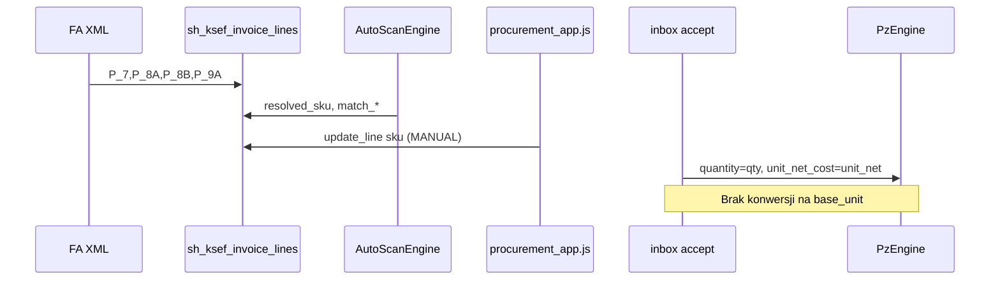
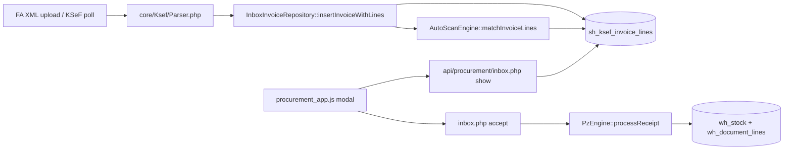

# KSeF → magazyn: normalizacja ilości i kosztu jednostkowego

**Status:** Zaimplementowano na **`main`** (2026-05-22) · PR #32 + P3 + migracje **058** / **059**  
**Sesja wdrożenia:** [`_docs/sessions/2026-05-22_ksef_qty_normalization.md`](../sessions/2026-05-22_ksef_qty_normalization.md)  
**Kontekst:** Faktura realna — `BAZYLIA CIĘTA 20G`, 1,000 × SZT., 26,67 PLN/szt., magazyn `base_unit = kg` → oczekiwane **0,02 kg** i AVCO **1333,50 PLN/kg** (wartość linii 26,67 PLN bez zmiany).

> **Szybki start (dev):** `php scripts/apply_migrations_chain.php` → `php scripts/test_invoice_qty_normalizer.php` → Inbox KSeF → accept.

---

## Stan po wdrożeniu (aktualny kod na `main`)

| Warstwa | Zachowanie |
|---------|------------|
| `Parser` | `P_7`, `P_7A` (opis), `P_8A`/`P_8B`, `P_9A` → DB; KOR bez linii → `error`; KOR z liniami → `draft` + `warn` |
| `AutoScanEngine` | SKU po `external_name` + opcjonalnie `supplier_nip` (m059); `learnMapping` przy `update_line` / bulk |
| `sh_product_mapping` | `(tenant_id, supplier_nip, external_name)` → `internal_sku` + opcjonalnie `pack_qty_base`, `pack_invoice_unit` |
| `InboxQtyNormalize` | Cache `qty_normalized` po upload/reparse/update; **autorytatywne** przeliczenie w `accept` |
| `accept` | `quantity` / `unit_net_cost` w `sys_items.base_unit`; `blocked` → `400 NORMALIZATION_REQUIRED` |
| `reparse` | AutoScan **nie nadpisuje** linii z `resolved_by_user_id` (ręczne SKU) |
| `set_line_pack` | Ręczne `pack_qty_base` + `learnPackMapping` bez re-upload XML |
| UI | Podgląd „→ magazyn: …”; `warn` = ⚠ (accept dozwolony); `blocked` = czerwony baner (accept zablokowany) |

**Polityka `normalization_status`:**

| Status | Accept | UI |
|--------|--------|-----|
| `ok` | Tak | Zielony podgląd przeliczenia |
| `warn` | **Tak** (gramatura z nazwy / P_7A — manager widzi ⚠) | Żółty podgląd |
| `blocked` | **Nie** (`NORMALIZATION_REQUIRED`) | Komunikat + pole „Zapisz opak.” |

---

## ARCHIWUM — stan przed wdrożeniem (Faza 1 audyt, 2026-05-22)

> Poniższe sekcje dokumentują **problem i audyt sprzed implementacji**. Nie opisują dzisiejszego kodu — patrz tabelę „Stan po wdrożeniu” powyżej.

### Co system mapował wtedy (przed zmianą)

| Warstwa | Mapuje | Nie mapuje |
|---------|--------|------------|
| `Parser` + DB | `external_name`, `unit`, `qty`, `unit_net`, `line_net_minor` z FA | `base_unit`, gramatura z nazwy |
| `AutoScanEngine` | `external_name` → `resolved_sku` (EXACT/ALIAS/NAME/FUZZY) | `qty`, `unit`, cenę |
| `sh_product_mapping` | Pełny string `external_name` → `internal_sku` | Opakowanie, NIP dostawcy (do m058) |
| `update_line` | Ręczne SKU, `MANUAL` 100% | Learn mapping (tylko `smart_create_sku`) |
| `reparse` | Nadpisuje SKU z AutoScan, czyści `resolved_by_user_id` | Nie zmienia qty/unit z FA |
| `accept` | `qty` + `unit_net` → PZ 1:1 | `sys_items.base_unit` |

### Przepływ SKU (bez jednostek)



### Learn `sh_product_mapping`

- **Tak:** `smart_create_sku`, `PzEngine` po ALIAS (tylko gdy brak `resolved_sku` w payload — ręczne PZ).
- **Nie:** samo `update_line` przy wyborze SKU w inbox.

---

## Faza 1 — Raport audytu (read-only)

### 1.1 Przepływ end-to-end (potwierdzony w kodzie)



| Krok | Plik / akcja | Co trafia do magazynu |
|------|----------------|----------------------|
| Parse | `Parser.php` → `P_8A` (unit), `P_8B` (qty), `P_9A` (unit_net), `P_7` (nazwa) | Surowe wartości z FA — **bez** `base_unit`, **bez** parsowania wagi z nazwy |
| Zapis | `InboxInvoiceRepository.php` | `unit`, `qty`, `unit_net`, `line_net_minor` → `sh_ksef_invoice_lines` |
| Match | `AutoScanEngine` | Tylko `external_name` → `resolved_sku`; `qty`/`unit` w `matchBulk` są **echo** w odpowiedzi, nie wpływają na SKU |
| UI | `procurement_app.js` | Wyświetla `qty` + `unit` z FA; SKU z listy `sys_items.base_unit` tylko w podpowiedzi selecta |
| Accept | `inbox.php` `accept` | `quantity = qty`, `unit_net_cost = unit_net` — **bez JOIN** do `sys_items`, **bez konwersji** |
| PZ | `PzEngine.php` | `wh_stock.quantity += quantity`; AVCO = średnia ważona z `unit_net_cost` w jednostce **jaką poda accept** |

**Wniosek:** Problem zgłoszony przez użytkownika jest **potwierdzony**. Dla linii 1 szt × 20 g przy `base_unit = kg` system zapisze **+1 kg** po **26,67 PLN/kg** zamiast **+0,02 kg** po **1333,50 PLN/kg** (przy zachowaniu wartości netto linii 26,67 PLN).

### 1.2 AVCO i spójność wartości

W `PzEngine::processReceipt`:

- `line_net_value = round(quantity × unit_net_cost, 2)` (faza walidacji, przed transakcją).
- `new_avco = (oldQty × oldAvco + rcvQty × unitNetCost) / (oldQty + rcvQty)`.

Przy błędnej ilości **i** błędnym koszcie jednostkowym:

- Wartość dokumentu PZ może przypadkiem zostać bliska (1 × 26,67 ≈ 0,02 × 1333,5), ale **stan magazynu** i **AVCO w kg** są fundamentalnie złe.
- Receptury (`sh_recipes.quantity_base` w jednostce `sys_items.base_unit`) i Food Cost (`studio_margin.js` mnoży `quantity_base` × AVCO po konwersji jednostek) będą korzystać z **złego AVCO w kg**.

**Invariant biznesowy po normalizacji:**

```text
qty_invoice × unit_net_invoice ≈ qty_base × unit_net_base ≈ line_net (PLN)
```

Przelicznik: `qty_base = qty_invoice × pack_qty_base`, `unit_net_base = line_net / qty_base`.

### 1.3 Reverse / KOR (`inbox.php` → `reverse`)

- Cofa magazyn na podstawie **`wh_document_lines`** z powiązanego PZ (`linked_wh_document_id`).
- **Nie** czyta ponownie `sh_ksef_invoice_lines.qty`.
- Jeśli normalizacja nastąpi tylko w `accept`, reverse pozostaje spójny.
- Jeśli kiedyś edytujemy linie faktury po accept — wymaga osobnej polityki (dziś accept jest terminalny poza `reverse`).

### 1.4 Gdzie jest już logika jednostek (unikanie duplikacji)

| Miejsce | Zakres | Używane w procurement? |
|---------|--------|----------------------|
| `core/js/core_validator.js` (`SliceValidator`) | `kg/g/dag`, `l/ml`, `szt/pcs`, `op`; `convert()`, `standardizeUnit()` | **Nie** — brak importu w `procurement/index.html` |
| `modules/studio/js/studio_recipe.js` | Walidacja wiersza receptury vs `base_unit` | Nie |
| `modules/studio/js/studio_margin.js` | Food Cost: `SliceValidator.convert` przed × AVCO | Nie |
| `modules/warehouse/js/warehouse_rw.js` | RW: `standardizeUnit` na ilości wprowadzonej | Nie (inna ścieżka niż KSeF) |
| `modules/warehouse/js/warehouse_pz.js` | Ręczne PZ: qty/cena **jak wpisze użytkownik** | Nie |
| PHP `core/` | Po wdrożeniu: **`core/Units.php`** (+ normalizer w accept) | **Tak** (KSeF accept) |

**Jedyna wspólna „prawda” do przeniesienia:** mapa `UNITS_CANON` z `SliceValidator` → port do PHP (`core/Units.php` lub `core/UnitConverter.php`) + opcjonalnie require tego samego pliku JS z PHP jako nie — utrzymujemy **dwie kopie z jednym testem kontraktu** (patrz sekcja B).

### 1.5 AutoScan a „20G” w nazwie

- Tokenizer: `MIN_TOKEN_LEN = 3` → `20g` po normalizacji może trafić do FUZZY jako token, **nie** jako ilość.
- `sh_product_mapping` ma tylko `(tenant_id, external_name, internal_sku)` — **brak** `pack_size`, `invoice_unit`.
- `smart_create_sku` ustawia `base_unit` z dropdownu (domyślnie z linii FA: `kg/l/szt/m`) — przy SZT. na FA manager może utworzyć SKU ze złą jednostką bazową.

### 1.6 Model OPEX (m057)

- `line_type INVENTORY|EXPENSE` — normalizacja dotyczy **wyłącznie INVENTORY** z `resolved_sku`.
- EXPENSE nie idzie do `PzEngine` — bez zmian w tym obszarze.

---

### 1.7 Przypadki brzegowe (faktury gastronomiczne PL)

| # | FA qty × unit | Nazwa / kontekst | `sys_items.base_unit` | Oczekiwane zachowanie | Trudność |
|---|---------------|------------------|-------------------------|------------------------|----------|
| E1 | 1 × SZT. | `BAZYLIA 20G` | kg | 0,02 kg; cena/kg = netto/0,02 | Waga w nazwie + opakowanie |
| E2 | 10 × SZT. | `MASŁO 200G` | kg | 2 kg (10×0,2) | Ilość × waga opakowania |
| E3 | 1 × SZT. | `JAJKO L` | szt | 1 szt (bez przeliczenia masy) | Sztuka = sztuka |
| E4 | 2,5 × kg | — | kg | 2,5 kg | Trywialne |
| E5 | 500 × g | — | kg | 0,5 kg | Konwersja jednostki FA |
| E6 | 1 × l | — | l | 1 l | Trywialne |
| E7 | 750 × ml | — | l | 0,75 l | Konwersja objętości |
| E8 | 1 × OP. | `KARTON 6×1L` | l | Wymaga rozpoznania **6 l** lub blokady | Wielokrotność w nazwie |
| E9 | 1 × SZT. | `POMIDOR KOKTAIL` (bez wagi) | kg | **`blocked`** — accept zablokowany; `set_line_pack` lub inny SKU | Fałszywy regex |
| E10 | 1 × kg | nazwa `20G` (myjąca) | kg | **Nie** brać 20 g z nazwy gdy FA już w kg | Konflikt nazwa vs FA |
| E11 | 0,001 × t | — | kg | 1 kg (jeśli obsługa `t`) | Rzadkie, słownik rozszerzalny |
| E12 | 1 × SZT. | ta sama nazwa, inny dostawca, inna waga | kg | Per-dostawca mapping (learn) | Wielodostawca |
| E13 | Korekta KOR | ujemne qty na FA | kg | Reverse osobno; forward musi być spójny | Ścieżka `reverse` |
| E14 | Zaokrąglenia | `line_net_minor` ≠ qty×unit_net | — | Priorytet **line_net** przy wyliczaniu `unit_net_base` | Groszowe różnice |

**Zasada rozstrzygania konfliktu (E10):** jeśli jednostka FA jest już w tej samej **grupie bazowej** co `base_unit` (np. kg), **nie** stosuj ekstrakcji masy z nazwy do przeliczenia SZT→kg; wyłącznie konwersja FA unit → base unit.

---

## Faza 2 — Propozycja architektury

### Najpierw: rekomendacja lepsza niż „sam regex”

**Model warstwowy (Mapping-first + Unit canon + Name fallback):**

1. **Warstwa A — `sh_product_mapping` rozszerzone (learn)**  
   Przy accept / `set_line_pack` / gramatura z nazwy: `pack_qty_base`, `pack_invoice_unit`, klucz `(tenant_id, supplier_nip, external_name)` (m059). Kolejna faktura z tą samą nazwą + NIP → przelicznik **bez regex**.

2. **Warstwa B — `core/Units.php` (port `SliceValidator`)**  
   FA `P_8A` znormalizowane (`SZT.`→`szt`, `KG`→`kg`) → przeliczenie do `sys_items.base_unit` gdy grupy zgodne (Masa/Objętość/Sztuka/Opakowanie).

3. **Warstwa C — `PackSizeExtractor` (regex + P_7A)**  
   Tylko gdy: `base_unit` ∈ {kg, l}, FA unit ∈ {szt, op, …} **oraz** brak wpisu w warstwie A. Wzorce: `20G`, `6×1L`, opis `P_7A`. Wynik: `pack_qty_base` **na 1 jednostkę FA**.

4. **Warstwa D — UI preview + polityka błędu**  
   `show` / modal: „→ magazyn: 0,02 kg @ 1333,50 PLN/kg”. Accept **zablokowany** tylko przy `normalization_status = blocked`. Przy `warn` — podgląd + ⚠, accept **dozwolony** (bez checkboxa — uproszczenie vs pierwotna propozycja).

Regex sam w sobie jest **warstwą C**, nie całym rozwiązaniem — zgodnie z audytem i network effect AutoScan.

---

### A. Rozwiązanie docelowe (SliceHub)

| Element | Rekomendacja / implementacja |
|---------|------------------------------|
| Klasa | `core/InvoiceLineQtyNormalizer.php` — `normalize($line, $sysItem, $packMapping)`; wrapper API: `InboxQtyNormalize::normalizeLine()` |
| Kiedy liczyć | **(1)** Po `insert`/`reparse`/`update_line` — cache w DB; **(2)** Ponownie w `accept` — autoritative (Prawo IV) |
| Wejście | `qty`, `unit`, `unit_net`, `line_net_minor`, `external_name`, `external_description` (P_7A), `supplier_nip`, `resolved_sku` → `sys_items.base_unit` po SKU + `tenant_id` |
| Wyjście PZ | `quantity` = qty w `base_unit`; `unit_net_cost` = `line_net / quantity` (`line_net_minor` jako source of truth) |
| Parser nazwy | `PackSizeExtractor::extractPerPiece()` — testy E1–E9 + P_7A w CLI |
| Gdy brak przeliczenia | `normalization_status = blocked` → accept `400 NORMALIZATION_REQUIRED`; UI: `set_line_pack` |

**Pseudokod accept (fragment):**

```php
foreach ($inventoryLines as $l) {
    $item = loadSysItem($tenantId, $l['resolved_sku']);
    $mapping = loadMapping($tenantId, $l['external_name'], $invoice['supplier_nip']);
    $norm = InvoiceLineQtyNormalizer::normalize($l, $item, $mapping);
    if (!empty($norm['is_blocked'])) {
        inboxFail(400, 'NORMALIZATION_REQUIRED', $norm['message'] ?? 'Normalizacja zablokowana.');
    }
    $pzLines[] = [
        'resolved_sku'  => $l['resolved_sku'],
        'quantity'      => $norm->qtyBase,
        'unit_net_cost' => $norm->unitNetBase,
        'vat_rate'      => $l['vat_rate'],
        'external_name' => $l['external_name'],
    ];
}
PzEngine::processReceipt(...);
```

---

### B. Ulepszenia koncepcji (cache, UI, learn)

| Ulepszenie | Opis | Stan |
|------------|------|------|
| Kolumny na `sh_ksef_invoice_lines` | `qty_normalized`, `unit_net_normalized`, `normalization_status` (`ok`/`warn`/`blocked`), `normalization_meta` | **058** ✓ |
| Podgląd w modalu | `show` + `preview_normalize`; wiersz „→ magazyn: …” | ✓ |
| Rozszerzenie `sh_product_mapping` | `pack_qty_base`, `pack_invoice_unit`, `supplier_nip`; UNIQUE `(tenant, nip, external_name)` | **058** + **059** ✓ |
| Learn pack | `learnPackMapping()` po accept (gramatura z nazwy) + `set_line_pack` | ✓ |
| Learn SKU | `AutoScanEngine::learnMapping` przy `update_line` / bulk + NIP | ✓ (P3) |
| Kontrakt PHP+JS | `_tests/units_contract.json` wspólny dla PHP i JS | **Nie wdrożono** — tylko `core/Units.php` + test CLI |

---

### C. Czego NIE robić

- Nie zmieniać progów / scoringu **AutoScanEngine** (SKU matching).
- Nie przenosić normalizacji wyłącznie do `procurement_app.js` (Zero Zaufania).
- Nie modyfikować `PzEngine` AVCO — tylko podawać poprawne `quantity` / `unit_net_cost`.
- Nie psuć **EXPENSE** / m057 / `set_cost_category`.
- Nie ruszać ręcznego PZ (`warehouse_pz.js`) — operator odpowiada za jednostkę.
- Nie JOIN-ować cross-silo po `id`.

---

### D. Plan wdrożenia — wykonanie

| Etap | Zakres | Stan |
|------|--------|------|
| **PR-1** | `Units.php` + `PackSizeExtractor` + `InvoiceLineQtyNormalizer` + CLI E1–E9 | ✓ merged |
| **PR-2** | Migracja **058** + cache w upload/reparse; `show` z polami normalizacji | ✓ merged (#32) |
| **PR-3** | `accept` + `preview_normalize` + `set_line_pack`; learn pack; **059** UNIQUE NIP | ✓ merged (P3) |
| **PR-4** | `procurement_app.js` — podgląd, `set_line_pack`, filtr `error` | ✓ |
| **PR-5** | Sesja + ten dokument + testy CLI | ✓ |

**Nie wdrożono z pierwotnej propozycji:** checkbox potwierdzenia przy `warn`; `_tests/units_contract.json`; retroaktywna korekta starych PZ.

**Ryzyka regresji:** istniejące zaakceptowane faktury — **nie** retroaktywnie; tylko nowe accept. Ręczne PZ bez zmian.

**Test E2E (manual):** XML testowy 1× SZT `BAZYLIA 20G` → accept → `wh_stock` +0,02; AVCO ≈ 1333,50 PLN/kg; `line_net` PZ = 26,67 PLN.

---

### E. Kryteria akceptacji

1. Linia E1: po accept stan magazynu rośnie o **0,02 kg** (nie 1 kg).
2. `unit_net_cost` w `wh_document_lines` ≈ **1333,50 PLN/kg** (dopuszczalne ±0,01 przez zaokrąglenie).
3. `line_net_value` dokumentu PZ = **26,67 PLN** (zgodne z FA).
4. Food Cost po accept nie skacze o rząd wielkości dla tego SKU.
5. `reverse` cofa dokładnie ilość z PZ (0,02 kg).
6. Linia E9 (brak wagi): accept **zablokowany** (`blocked`) z komunikatem; `set_line_pack` lub zmiana SKU.
7. Linia E1 z `warn` (gramatura z nazwy): accept **dozwolony** po weryfikacji podglądu (⚠).
8. AutoScan: ten sam SKU/confidence co przed zmianą dla tej samej nazwy (progi bez zmian).

---

## Decyzja: migracja vs logika only

| Opcja | Zalety | Wady | Złożoność |
|-------|--------|------|-----------|
| **Tylko logika w `accept`** | Brak migracji, szybki MVP | Brak podglądu przed kliknięciem; trudny audyt historyczny | Niska |
| **Cache w DB + accept** (rekomendowane) | Preview w UI, audyt, reparse idempotentny | Migracja 058 + aktualizacja `show` | Średnia |
| **Nadpisywanie `qty` w DB** | Prostsze SELECT | Utrata oryginału FA (compliance) | Odrzucone |
| **Tylko rozszerzenie mapping bez regex** | Bardzo bezpieczne po nauczeniu | Pierwsza faktura zawsze ręczna | Średnia długoterminowo |

**Rekomendacja #1 (wdrożona):** Cache w DB (`qty_normalized`, `unit_net_normalized`, `normalization_meta`) + autoritative przeliczenie w `accept` + `pack_qty_base` / `pack_invoice_unit` na `sh_product_mapping` (058) + UNIQUE per NIP (059).

**Bez migracji wystarczy tylko na POC** — do produkcji z przejrzystością dla managera **migracja jest potrzebna**.

---

## Alternatywy (skrót)

| # | Podejście | Zalety | Wady | Złożoność |
|---|-----------|--------|------|-----------|
| Alt-1 | Tylko regex na `external_name` | Szybkie | Fałszywe trafienia (E9, E10); brak learn | Niska |
| Alt-2 | Wymuś `base_unit = szt` przy SZT. na FA | Brak konwersji | Receptury w kg się rozjeżdżają | Niska — **odrzucone** |
| Alt-3 | Manager ręcznie edytuje `qty` w UI przed accept | Bez kodu backend | Błędy ludzkie, skala | Bardzo niska |
| Alt-4 | **Rekomendacja warstwowa** (A+B+C+D) | Learn + preview + zgodność z Food Cost | 2–3 PR | Średnia |

---

## Faza 3 — Implementacja (referencja kodu)

| Plik | Rola |
|------|------|
| `core/Units.php` | Kanon jednostek (port `SliceValidator`) |
| `core/PackSizeExtractor.php` | Gramatura z nazwy / P_7A (20G, 6×1L) |
| `core/InvoiceLineQtyNormalizer.php` | Przeliczenie + `learnPackMapping()` |
| `core/Ksef/InboxQtyNormalize.php` | Cache linii + `resolvePzLine()` dla PZ |
| `core/Ksef/InboxImport.php` | Refresh cache po imporcie |
| `core/Ksef/Parser.php` | `P_7A` → `external_description`; jakość KOR |
| `core/AutoScanEngine.php` | Match + learn z `supplier_nip` |
| `database/migrations/058_ksef_line_qty_normalization.sql` | Kolumny cache + `pack_*` na mapping |
| `database/migrations/059_product_mapping_unique_supplier.sql` | UNIQUE `(tenant_id, supplier_nip, external_name)` |
| `api/procurement/inbox.php` | `accept`, `preview_normalize`, `set_line_pack`, `update_line`, `reparse` |
| `api/procurement/ksef_config.php` | `poll_now` → statystyka `quality_error` |
| `modules/procurement/js/procurement_app.js` | Podgląd „→ magazyn”, pack row, reassess |
| `scripts/test_invoice_qty_normalizer.php` | CLI: E1–E9, mapping, P_7A |
| `scripts/test_ksef_parser_quality.php` | CLI: KOR z liniami → `draft`+`warn` |
| `scripts/seed_demo_all.php` | Demo: mapping P_7A bazylia + faktura `FA/DEMO/*` |

**Migracje:** `php scripts/apply_migrations_chain.php` (łańcuch do **059**).

**Testy CLI:**

```bash
php scripts/test_invoice_qty_normalizer.php   # 10 asercji
php scripts/test_ksef_parser_quality.php      # 8 asercji
php scripts/audit_ksef_matching.php             # audyt mapowań (opcjonalnie)
```

**Test (E2E) manualny:**

1. Upload FA: `BAZYLIA CIĘTA 20G` lub nazwa + **P_7A** `200G`, 1 SZT, SKU `BAZYLIA_SW` / `kg`.
2. Modal: podgląd `→ magazyn: 0,020 kg @ … PLN/kg`.
3. Accept → PZ: `+0,02 kg`, AVCO ≈ 1333,50 PLN/kg, `line_net` = 26,67 PLN.
4. Opcjonalnie: `set_line_pack` bez ponownego uploadu XML.

**Demo bez XML:** po `seed_demo_all.php` — faktura `FA/DEMO/2026/001` (tenant 1) w Inbox KSeF.
