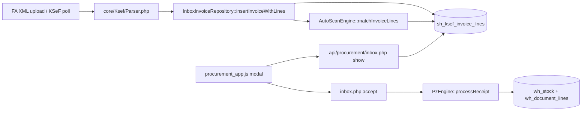

# KSeF → magazyn: normalizacja ilości i kosztu jednostkowego

**Status:** Propozycja (Faza 2) — **bez implementacji produkcyjnej**  
**Data:** 2026-05-22  
**Kontekst:** Faktura realna — `BAZYLIA CIĘTA 20G`, 1,000 × SZT., 26,67 PLN/szt., magazyn `base_unit = kg` → oczekiwane **0,02 kg** i AVCO **1333,50 PLN/kg** (wartość linii 26,67 PLN bez zmiany).

---

## Faza 1 — Raport audytu (read-only)

### 1.1 Przepływ end-to-end (potwierdzony w kodzie)



| Krok | Plik / akcja | Co trafia do magazynu |
|------|----------------|----------------------|
| Parse | `Parser.php` → `P_8A` (unit), `P_8B` (qty), `P_9A` (unit_net), `P_7` (nazwa) | Surowe wartości z FA — **bez** `base_unit`, **bez** parsowania wagi z nazwy |
| Zapis | `InboxInvoiceRepository.php` | `unit`, `qty`, `unit_net`, `line_net_minor` → `sh_ksef_invoice_lines` |
| Match | `AutoScanEngine` | Tylko `external_name` → `resolved_sku`; `qty`/`unit` w `matchBulk` są **echo** w odpowiedzi, nie wpływają na SKU |
| UI | `procurement_app.js` | Wyświetla `qty` + `unit` z FA; SKU z listy `sys_items.base_unit` tylko w podpowiedzi selecta |
| Accept | `inbox.php` `accept` | `quantity = qty`, `unit_net_cost = unit_net` — **bez JOIN** do `sys_items`, **bez konwersji** |
| PZ | `PzEngine.php` | `wh_stock.quantity += quantity`; AVCO = średnia ważona z `unit_net_cost` w jednostce **jaką poda accept** |

**Wniosek:** Problem zgłoszony przez użytkownika jest **potwierdzony**. Dla linii 1 szt × 20 g przy `base_unit = kg` system zapisze **+1 kg** po **26,67 PLN/kg** zamiast **+0,02 kg** po **1333,50 PLN/kg** (przy zachowaniu wartości netto linii 26,67 PLN).

### 1.2 AVCO i spójność wartości

W `PzEngine::processReceipt`:

- `line_net_value = round(quantity × unit_net_cost, 2)` (faza walidacji, przed transakcją).
- `new_avco = (oldQty × oldAvco + rcvQty × unitNetCost) / (oldQty + rcvQty)`.

Przy błędnej ilości **i** błędnym koszcie jednostkowym:

- Wartość dokumentu PZ może przypadkiem zostać bliska (1 × 26,67 ≈ 0,02 × 1333,5), ale **stan magazynu** i **AVCO w kg** są fundamentalnie złe.
- Receptury (`sh_recipes.quantity_base` w jednostce `sys_items.base_unit`) i Food Cost (`studio_margin.js` mnoży `quantity_base` × AVCO po konwersji jednostek) będą korzystać z **złego AVCO w kg**.

**Invariant biznesowy po normalizacji:**

```text
qty_invoice × unit_net_invoice ≈ qty_base × unit_net_base ≈ line_net (PLN)
```

Przelicznik: `qty_base = qty_invoice × pack_factor_to_base`, `unit_net_base = line_net / qty_base`.

### 1.3 Reverse / KOR (`inbox.php` → `reverse`)

- Cofa magazyn na podstawie **`wh_document_lines`** z powiązanego PZ (`linked_wh_document_id`).
- **Nie** czyta ponownie `sh_ksef_invoice_lines.qty`.
- Jeśli normalizacja nastąpi tylko w `accept`, reverse pozostaje spójny.
- Jeśli kiedyś edytujemy linie faktury po accept — wymaga osobnej polityki (dziś accept jest terminalny poza `reverse`).

### 1.4 Gdzie jest już logika jednostek (unikanie duplikacji)

| Miejsce | Zakres | Używane w procurement? |
|---------|--------|----------------------|
| `core/js/core_validator.js` (`SliceValidator`) | `kg/g/dag`, `l/ml`, `szt/pcs`, `op`; `convert()`, `standardizeUnit()` | **Nie** — brak importu w `procurement/index.html` |
| `modules/studio/js/studio_recipe.js` | Walidacja wiersza receptury vs `base_unit` | Nie |
| `modules/studio/js/studio_margin.js` | Food Cost: `SliceValidator.convert` przed × AVCO | Nie |
| `modules/warehouse/js/warehouse_rw.js` | RW: `standardizeUnit` na ilości wprowadzonej | Nie (inna ścieżka niż KSeF) |
| `modules/warehouse/js/warehouse_pz.js` | Ręczne PZ: qty/cena **jak wpisze użytkownik** | Nie |
| PHP `core/` | **Brak** klasy konwersji jednostek | — |

**Jedyna wspólna „prawda” do przeniesienia:** mapa `UNITS_CANON` z `SliceValidator` → port do PHP (`core/Units.php` lub `core/UnitConverter.php`) + opcjonalnie require tego samego pliku JS z PHP jako nie — utrzymujemy **dwie kopie z jednym testem kontraktu** (patrz sekcja B).

### 1.5 AutoScan a „20G” w nazwie

- Tokenizer: `MIN_TOKEN_LEN = 3` → `20g` po normalizacji może trafić do FUZZY jako token, **nie** jako ilość.
- `sh_product_mapping` ma tylko `(tenant_id, external_name, internal_sku)` — **brak** `pack_size`, `invoice_unit`.
- `smart_create_sku` ustawia `base_unit` z dropdownu (domyślnie z linii FA: `kg/l/szt/m`) — przy SZT. na FA manager może utworzyć SKU ze złą jednostką bazową.

### 1.6 Model OPEX (m057)

- `line_type INVENTORY|EXPENSE` — normalizacja dotyczy **wyłącznie INVENTORY** z `resolved_sku`.
- EXPENSE nie idzie do `PzEngine` — bez zmian w tym obszarze.

---

### 1.7 Przypadki brzegowe (faktury gastronomiczne PL)

| # | FA qty × unit | Nazwa / kontekst | `sys_items.base_unit` | Oczekiwane zachowanie | Trudność |
|---|---------------|------------------|-------------------------|------------------------|----------|
| E1 | 1 × SZT. | `BAZYLIA 20G` | kg | 0,02 kg; cena/kg = netto/0,02 | Waga w nazwie + opakowanie |
| E2 | 10 × SZT. | `MASŁO 200G` | kg | 2 kg (10×0,2) | Ilość × waga opakowania |
| E3 | 1 × SZT. | `JAJKO L` | szt | 1 szt (bez przeliczenia masy) | Sztuka = sztuka |
| E4 | 2,5 × kg | — | kg | 2,5 kg | Trywialne |
| E5 | 500 × g | — | kg | 0,5 kg | Konwersja jednostki FA |
| E6 | 1 × l | — | l | 1 l | Trywialne |
| E7 | 750 × ml | — | l | 0,75 l | Konwersja objętości |
| E8 | 1 × OP. | `KARTON 6×1L` | l | Wymaga rozpoznania **6 l** lub blokady | Wielokrotność w nazwie |
| E9 | 1 × SZT. | `POMIDOR KOKTAIL` (bez wagi) | kg | **Brak automatycznej masy** → ostrzeżenie / mapowanie ręczne | Fałszywy regex |
| E10 | 1 × kg | nazwa `20G` (myjąca) | kg | **Nie** brać 20 g z nazwy gdy FA już w kg | Konflikt nazwa vs FA |
| E11 | 0,001 × t | — | kg | 1 kg (jeśli obsługa `t`) | Rzadkie, słownik rozszerzalny |
| E12 | 1 × SZT. | ta sama nazwa, inny dostawca, inna waga | kg | Per-dostawca mapping (learn) | Wielodostawca |
| E13 | Korekta KOR | ujemne qty na FA | kg | Reverse osobno; forward musi być spójny | Ścieżka `reverse` |
| E14 | Zaokrąglenia | `line_net_minor` ≠ qty×unit_net | — | Priorytet **line_net** przy wyliczaniu `unit_net_base` | Groszowe różnice |

**Zasada rozstrzygania konfliktu (E10):** jeśli jednostka FA jest już w tej samej **grupie bazowej** co `base_unit` (np. kg), **nie** stosuj ekstrakcji masy z nazwy do przeliczenia SZT→kg; wyłącznie konwersja FA unit → base unit.

---

## Faza 2 — Propozycja architektury

### Najpierw: rekomendacja lepsza niż „sam regex”

**Model warstwowy (Mapping-first + Unit canon + Name fallback):**

1. **Warstwa A — `sh_product_mapping` rozszerzone (learn)**  
   Przy pierwszym accept lub ręcznej korekcie zapis: `pack_qty`, `pack_unit`, `invoice_unit_hint` (opcjonalnie `supplier_nip` w kluczu). Kolejna faktura z tą samą `external_name` (+ ten sam NIP) → deterministyczny przelicznik **bez regex**.

2. **Warstwa B — `UnitConverter` (PHP, wspólny kontrakt z JS)**  
   FA `P_8A` znormalizowane (`SZT.`→`szt`, `KG`→`kg`) → przeliczenie do `sys_items.base_unit` gdy grupy zgodne (Masa/Objętość/Sztuka/Opakowanie).

3. **Warstwa C — `PackSizeExtractor` (regex + słownik)**  
   Tylko gdy: `base_unit` ∈ {kg, l}, FA unit ∈ {szt, op, …} **oraz** brak wpisu w warstwie A. Wzorce: `(\d+(?:[.,]\d+)?)\s*(G|KG|ML|L)\b`, `6×1L`, `12x500ml`. Wynik: `pack_factor` w jednostce bazowej **na 1 jednostkę FA**.

4. **Warstwa D — UI preview + polityka błędu**  
   `show` / modal: „Z faktury: 1 szt → Do magazynu: 0,02 kg (@ 1333,50 PLN/kg)”. Accept **zablokowany** gdy `confidence < 100%` na ilości (nie na SKU) — manager musi potwierdzić checkbox lub uzupełnić mapping.

Regex sam w sobie jest **warstwą C**, nie całym rozwiązaniem — zgodnie z audytem i network effect AutoScan.

---

### A. Rozwiązanie docelowe (SliceHub)

| Element | Rekomendacja |
|---------|----------------|
| Klasa | `core/InvoiceLineQtyNormalizer.php` (stanless, czyste funkcje + `normalizeLine(array $line, array $sysItem, ?array $mapping, array $opts): NormalizationResult`) |
| Kiedy liczyć | **(1)** Po `insert`/`reparse` — zapis cache do DB; **(2)** Ponownie w `accept` — autoritative, nie ufaj wyłącznie cache (Prawo IV) |
| Wejście | `qty`, `unit`, `unit_net`, `line_net_minor`, `external_name`, `supplier_nip`, `resolved_sku` → JOIN `sys_items.base_unit` po SKU (cross-silo po SKU + `tenant_id`) |
| Wyjście PZ | `quantity` = qty w `base_unit`; `unit_net_cost` = `line_net / quantity` (grosze z `line_net_minor` jako source of truth przy rozjazdach ≤ 1 gr) |
| Parser nazwy | `PackSizeExtractor` — osobna klasa, testowana tabelą przypadków E1–E14 |
| GTU/PKWiU | Faza 1.5 — tylko logowanie; nie blokować MVP (słaba korelacja z gramaturą) |
| Gdy brak przeliczenia | `status: needs_review` — accept zwraca `400 NORMALIZATION_REQUIRED` z meta; UI: żółty baner + pole „Gramatura opakowania (kg)” |

**Pseudokod accept (fragment):**

```php
foreach ($inventoryLines as $l) {
    $item = loadSysItem($tenantId, $l['resolved_sku']);
    $mapping = loadMapping($tenantId, $l['external_name'], $invoice['supplier_nip']);
    $norm = InvoiceLineQtyNormalizer::normalize($l, $item, $mapping);
    if (!$norm->isOk() && !$norm->isConfirmed()) {
        inboxFail(400, 'NORMALIZATION_REQUIRED', $norm->message, $norm->toArray());
    }
    $pzLines[] = [
        'resolved_sku'  => $l['resolved_sku'],
        'quantity'      => $norm->qtyBase,
        'unit_net_cost' => $norm->unitNetBase,
        'vat_rate'      => $l['vat_rate'],
        'external_name' => $l['external_name'],
    ];
}
PzEngine::processReceipt(...);
```

---

### B. Ulepszenia koncepcji (cache, UI, learn)

| Ulepszenie | Opis |
|------------|------|
| Kolumny na `sh_ksef_invoice_lines` | `qty_normalized`, `unit_net_normalized`, `normalization_status` (`ok`/`warn`/`blocked`), `normalization_meta` JSON |
| Podgląd w modalu | Wiersz pod tabelą FA: przeliczenie + AVCO preview (opcjonalnie AJAX `preview_normalize` action) |
| Rozszerzenie `sh_product_mapping` | `pack_factor_base`, `pack_unit`, `source` (`learn`/`manual`), opcjonalnie `supplier_nip` |
| Learn | Po accept z potwierdzoną korektą → `learnPackMapping()` (jak `learnMapping` dla SKU) |
| Kontrakt PHP+JS | `core/Units.php` + `_tests/units_contract.json` wspólny dla PHP i testu generującego asserty w `test_runner` |

---

### C. Czego NIE robić

- Nie zmieniać progów / scoringu **AutoScanEngine** (SKU matching).
- Nie przenosić normalizacji wyłącznie do `procurement_app.js` (Zero Zaufania).
- Nie modyfikować `PzEngine` AVCO — tylko podawać poprawne `quantity` / `unit_net_cost`.
- Nie psuć **EXPENSE** / m057 / `set_cost_category`.
- Nie ruszać ręcznego PZ (`warehouse_pz.js`) — operator odpowiada za jednostkę.
- Nie JOIN-ować cross-silo po `id`.

---

### D. Plan wdrożenia (kolejność PR)

| PR | Zakres | Migracja |
|----|--------|----------|
| **PR-1** | `core/Units.php` + `PackSizeExtractor` + `InvoiceLineQtyNormalizer` + testy jednostkowe PHP (tabela E1–E8) | Opcjonalnie brak — tylko logika |
| **PR-2** | Migracja `058_ksef_line_normalization.sql` + chain; zapis cache w `reparse`/`upload`; `show` zwraca pola | **Tak** |
| **PR-3** | `inbox.php` `accept` + `preview_normalize`; learn pack w mapping | Rozszerzenie `sh_product_mapping` w tej samej lub **058b** migracji |
| **PR-4** | `procurement_app.js` — UI preview, blokada accept, formularz korekty | Bez |
| **PR-5** | Dokumentacja manual test + wpis `_docs/sessions/2026-05-22_ksef_qty_normalization.md` | — |

**Ryzyka regresji:** istniejące zaakceptowane faktury — **nie** retroaktywnie; tylko nowe accept. Ręczne PZ bez zmian.

**Test E2E (manual):** XML testowy 1× SZT `BAZYLIA 20G` → accept → `wh_stock` +0,02; AVCO ≈ 1333,50 PLN/kg; `line_net` PZ = 26,67 PLN.

---

### E. Kryteria akceptacji

1. Linia E1: po accept stan magazynu rośnie o **0,02 kg** (nie 1 kg).
2. `unit_net_cost` w `wh_document_lines` ≈ **1333,50 PLN/kg** (dopuszczalne ±0,01 przez zaokrąglenie).
3. `line_net_value` dokumentu PZ = **26,67 PLN** (zgodne z FA).
4. Food Cost po accept nie skacze o rząd wielkości dla tego SKU.
5. `reverse` cofa dokładnie ilość z PZ (0,02 kg).
6. Linia E9 (brak wagi): accept **zablokowany** z czytelnym komunikatem, nie cichy błąd.
7. AutoScan: ten sam SKU/confidence co przed zmianą dla tej samej nazwy.

---

## Decyzja: migracja vs logika only

| Opcja | Zalety | Wady | Złożoność |
|-------|--------|------|-----------|
| **Tylko logika w `accept`** | Brak migracji, szybki MVP | Brak podglądu przed kliknięciem; trudny audyt historyczny | Niska |
| **Cache w DB + accept** (rekomendowane) | Preview w UI, audyt, reparse idempotentny | Migracja 058 + aktualizacja `show` | Średnia |
| **Nadpisywanie `qty` w DB** | Prostsze SELECT | Utrata oryginału FA (compliance) | Odrzucone |
| **Tylko rozszerzenie mapping bez regex** | Bardzo bezpieczne po nauczeniu | Pierwsza faktura zawsze ręczna | Średnia długoterminowo |

**Rekomendacja #1:** **Cache w DB (`qty_normalized`, `unit_net_normalized`, `normalization_meta`) + autoritative przeliczenie w `accept` + rozszerzenie `sh_product_mapping` w PR-3.**

**Bez migracji wystarczy tylko na POC** — do produkcji z przejrzystością dla managera **migracja jest potrzebna**.

---

## Alternatywy (skrót)

| # | Podejście | Zalety | Wady | Złożoność |
|---|-----------|--------|------|-----------|
| Alt-1 | Tylko regex na `external_name` | Szybkie | Fałszywe trafienia (E9, E10); brak learn | Niska |
| Alt-2 | Wymuś `base_unit = szt` przy SZT. na FA | Brak konwersji | Receptury w kg się rozjeżdżają | Niska — **odrzucone** |
| Alt-3 | Manager ręcznie edytuje `qty` w UI przed accept | Bez kodu backend | Błędy ludzkie, skala | Bardzo niska |
| Alt-4 | **Rekomendacja warstwowa** (A+B+C+D) | Learn + preview + zgodność z Food Cost | 2–3 PR | Średnia |

---

## Następny krok

Po akceptacji tego dokumentu przez właściciela produktu → **Faza 3** na branchu `cursor/ksef-qty-normalization-b255`: PR-1…PR-4, commit z sekcją `Test (E2E):`, sesja w `_docs/sessions/`.

**Nie implementować kodu produkcyjnego przed akceptacją koncepcji.**
